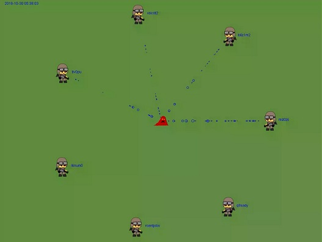

# Commit Game
Application which read commits logs (SVN yet) and produces a video.

## Status
This application is working well but was fast-written (5-6h) and could be improved (see wishlist)*.
Yet the application is a monster at screen center and commiters are fighters sending shots to the monster.
A step is for 6 hour of real life. Each shot is of size 1+sqrt(nb of commits during step). 
 

## Wishlist
- Add other 'games'
- Add more sprites like fighting, win
- Add sound
- Improve rendering speed
- Add options for video length
